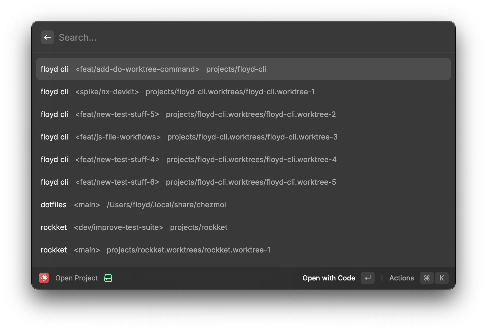
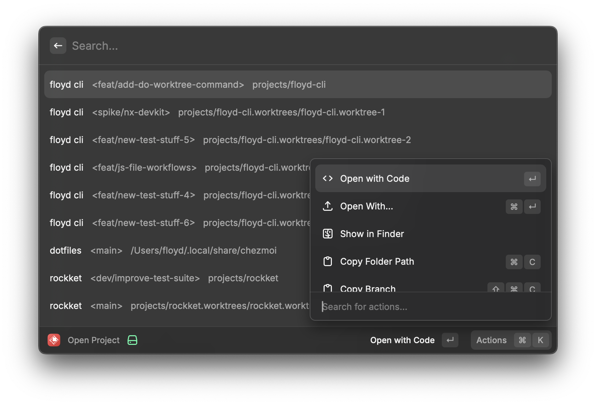

# Open Project Raycast Extension

Displays a Type-Ahead list of projects and their worktrees derived from the flo-cli config file and lets the user take various actions such as

- Open the Folder in vscode
- Show the Folder in finder
- Open the Folder "with"
- Copy the directory
- Copy the branch





## Installation

1.  Clone the repo
2.  Run `npm i`
3.  Run `npm run dev` then kill the dev server after raycast opened
4.  Done

## Config

Currently, the extension relies on a file at `$HOME/.config/.flo-cli/flo-cli.jsonc` with the following structure:

```jsonc
{
  "projects": {
    "my-project": {
      "root": "/Users/your-user/path/to/the/project",
    },
    "my-other-project": {
      "root": "/Users/your-user/path/to/the/other-project",
    },
  },
}
```
